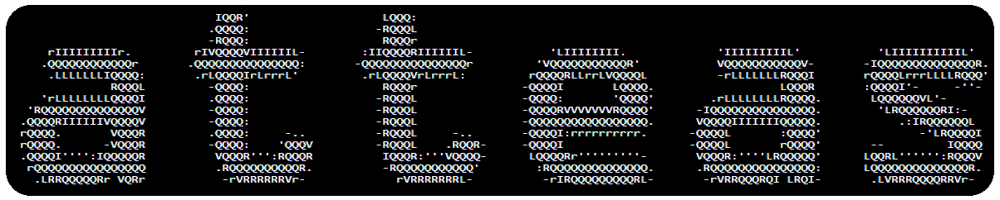

# Hi, my name is Atte!

## About me

```java
public class Me {
    //Information
    private String firstName = "Atte";
    private String occupation = "College Student 📚";
    private String[] skills = {"Python", "Java", "C++", "Web Development", "Cybersecurity"};
    private String[] hobbies = {"Coding", "Ethical Hacking", "Gaming", "Petting my pet lizard :)"};

    //functions
    public void introduce() {
        System.out.println("Hello! My name is " + firstName + " and I like programming!");
        System.out.println("My current occupation is: " + occupation + ".");
        System.out.println("My skills include: " + String.join(", ", skills));
        System.out.println("My hobbies are: " + String.join(", ", hobbies));
    }

    public void funFact() {
        System.out.println("Fun fact: I have a pet lizard and he is awesome! 🦎");
    }

    //main
    public static void main(String[] args) {
        Me me = new Me();

        //introduce myself
        me.introduce();

        //show off my nerdy side
        me.funFact();
    }
}
```